# Agents: how to work in this repo

Read this before touching code. It is the feedforward half of the harness: the map of what exists and the rules for moving inside it. The feedback half (Heimdall's hooks and `eitri check`) will tell you when you drift — but it is cheaper to not drift.

**Reading key:** ✅ **Do** — the expected action. ❌ **Don't** — a prohibited shortcut. ⚠️ **Check** — a condition that needs attention. These markers describe instructions, not completed checks.

| ✅ Do | ❌ Don't |
|---|---|
| Read the relevant guide and work within the owning slice. | Open another slice's implementation to bypass its contract. |
| Declare dependencies and dispatch contract messages through the bus. | Call another slice's handlers or engines directly. |
| Keep contracts framework-free and the kernel small. | Put FastAPI, pydantic, or application wiring in the kernel. |
| Raise `Problem` at the HTTP edge. | Raise `HTTPException` inside a slice. |
| Run the checks and fix the findings. | Disable rules or raise the token budget to make a change pass. |

## What this repo is

- `src/` is the **PFA API**, a FastAPI service built as vertical slices. This is what gets deployed.
  - `src/http_common/` is the HTTP-edge helper package (RFC 9457 problem details). FastAPI-aware, so it is **not** the kernel; only `internal/routes.py` and the composition root import it.
- `tools/` is **development-only tooling** (Eitri, Heimdall, Brokkr). It is never deployed and never imported by `src/`.
- `tests/api` tests the service; `tests/tooling` tests the tooling.

## The dependency direction

✅ Follow arrows from the importing package to its dependency. ❌ Never import upwards or sideways into another slice's `internal/`.



[Mermaid source](docs/diagrams/dependencies.mmd)

- **`pfa_api` is NOT part of the kernel and never goes there.** It imports every slice's `internal/module.py`; the kernel must import nothing. Putting the app in the kernel creates a cycle and lets FastAPI into every contract.
- **`shared_kernel` is paid for by every slice** (EIT100) and importable from every contract (EIT003). Only tiny, framework-free, stable primitives belong there. When in doubt, it does not go in the kernel.
- **Shared FastAPI/pydantic helpers** go in `src/http_common/`, which only `internal/` and `pfa_api` import — never the kernel, never a contract. Today it holds the RFC 9457 error machinery (`Problem`, `install_problem_details`).
- **Nothing imports `pfa_api`.** It is the top of the arrow.

## Slice map

<!--heimdall:map-->
kernel: `shared_kernel` · slices: `src/slices` · budget: 15000 tokens per slice · regenerate with `heimdall map --root .`

| slice | depends on | fan-in | contract | routes |
|---|---|---|---|---|
| chunking | (none) | 1 | `src/slices/chunking/contract/` | `POST /chunking/split` |
| embeddings | chunking | 0 | `src/slices/embeddings/contract/` | `POST /embeddings/query`<br>`POST /embeddings/passages`<br>`POST /embeddings/similarity` |
<!--/heimdall:map-->

Each slice's own `AGENTS.md` (in `src/slices/<name>/`) carries its generated `depends on:` and `routes:` lines plus a few hand-written notes on what the slice is for.

✅ Regenerate the table and marked lines from `slice.json` and `internal/routes.py` with `heimdall map --root .`. ❌ Do not edit generated content by hand. Hand-written guidance outside the markers remains editable.

## Guides

Task guides and rule instructions live in [harness/](harness/). Explanatory reference material lives in [docs/](docs/). This file and the slice-level `AGENTS.md` files remain the feedforward entry points.

Read the guide for the kind of change before loading any code; each one names the exact working set.

- **Adding a route** (new endpoint on an existing slice, with or without a contract change): [Adding a route](harness/guides/adding-a-route.md).
- **Returning an error** (what a route raises, what the client receives, how to add a problem type): [Returning errors](harness/guides/returning-errors.md).
- **What the PR check judges** (Jev's typed questions, the policy, how to run it locally): [PR review with Jev](harness/guides/pr-review.md).
- **Adding a slice** (a new feature with its own data and rules): [Adding a slice](#adding-a-slice).
- **Changing a contract**: [Changing a contract](#changing-a-contract), and the fan-in column in the slice map.

## The working set for a task

A task lives in **one slice**. Load, in this order, and nothing more:

1. `src/slices/<slice>/AGENTS.md` — the slice's declared dependencies.
2. `src/slices/<slice>/contract/` — its public surface.
3. `src/slices/<slice>/internal/` — its implementation and router.
4. `src/slices/<dep>/contract/` for each declared dependency — **only the contract**, never `internal/`.
5. `src/shared_kernel/` — the primitives every slice shares.
6. `src/http_common/` — only when the task touches a route's error path (`Problem`); declared shared in `[tool.heimdall]`, so reading it is never drift.

⚠️ If the task appears to require another slice's `internal/`, explain the missing contract capability before proceeding. ❌ Do not expand the working set by reading that implementation.

## The walls (Eitri enforces these; `eitri check --root .` must pass before you finish)

| Rule | ✅ Do | ❌ Don't |
|---|---|---|
| **EIT001 — boundaries** | Consume another slice through its `contract/`. Only the composition root imports its `internal/module.py`. | Import `slices.<other>.internal...` from a slice. |
| **EIT002 — visible coupling** | Use explicit, searchable imports inside `src/slices/`. | Use `importlib.import_module`, `__import__`, `sys.path` edits, `sys.modules` writes, or `from x import *`. |
| **EIT003 — pure contracts** | Import only stdlib, `shared_kernel`, and the slice's own contract in `contract/`. Keep FastAPI and pydantic in `internal/routes.py`. | Import frameworks or implementation code into a contract. |
| **EIT004 — declared dependencies** | Add `"x"` to `slice.json` before importing `slices.x.contract`. | Introduce an undeclared slice dependency. |
| **EIT005 — error shape** | At the HTTP edge, raise `Problem.domain_rejection(result.error)` or `Problem(status, detail, type=..., ...)` from `http_common`. | Raise FastAPI or Starlette `HTTPException` inside a slice. |
| **EIT100 — context budget** | Keep own source + dependency contract stubs + kernel within `[tool.eitri]`'s budget. Split the slice or slim its contract when needed. | Raise the budget to accommodate an oversized slice. |

## Adding a slice

1. Copy `src/slices/embeddings/` to `src/slices/<name>/`. Rename the files; one concept = one name everywhere.
2. Put dependencies (slice names only; the kernel is implicit) in `slice.json`.
3. Messages (`Query`/`Command` dataclasses) and result types go in `contract/`; engine, one handler per message, FastAPI router and `module.py` (`register(bus)` + `router`) go in `internal/`.
4. Add the module to `MODULES` in `src/pfa_api/composition.py`.
5. Run `heimdall map --root .` so this file, the slice's `AGENTS.md` and `.heimdall/map.json` learn the new seam. Then write a few hand-written lines under the generated ones in the slice's `AGENTS.md`: what it is for, and its working set.
6. Run `eitri check --root .` and `pytest`.

## CQRS in one paragraph

A slice's contract is its **messages** (frozen `Query`/`Command` dataclasses in `contract/queries.py` / `commands.py`) and **result types** (`contract/results.py`). Each message has exactly one handler in `internal/handlers.py`, registered on the kernel `Bus` by `module.py`. Routes and other slices never call handlers; they `bus.dispatch(message)` and get a `Result`. A route turns `Result.ok=False` into `Problem.domain_rejection(result.error)` — a 422 problem document (RFC 9457), never a bare `HTTPException`. New use case = message + result + handler + one `bus.register` line (+ a route if it has an HTTP edge). Tests replace a handler with `bus.register(..., replace=True)`.

## Changing a contract

⚠️ A contract with fan-in **10 or more** is frozen; Heimdall warns when you edit it.

- ✅ Make additive changes. For a breaking change, add the replacement, migrate every consumer, then remove the old member in a coordinated expand-contract migration.
- ❌ Do not change or remove an existing member while consumers still rely on it.

## Commands

```bash
pip install -e ".[dev]" -e ./tools   # once, in a dev environment
ruff check . && ruff format --check . && mypy   # lint, format, types — CI runs these first; `ruff check --fix . && ruff format .` repairs most of it
pytest                               # tests/api + tests/tooling (warnings are errors)
eitri check --root .                 # the walls + the budget — must be green
eitri surface <slice>                # what a consumer of <slice> actually loads
heimdall map --root .                # regenerate the maps after changing slices, slice.json or [tool.heimdall] shared
heimdall drift                       # how far recent agent sessions wandered from the map
heimdall review --base origin/main   # Jev judges the diff (needs TYPESAFE_API_KEY); what the PR check runs
python -m pfa_api                    # run the service
```

## What Heimdall will do while you work

With the Claude Code hooks configured and `.heimdall/map.json` present, supported Read/Grep/Glob/Edit/Write events are classified against the map and logged to `.heimdall/telemetry.jsonl`.

- ⚠️ **Immediate feedback:** hook exit 2 flags edits to a second slice in one session or to a frozen high fan-in contract. Check the dependency boundary or migration plan before continuing.
- ✅ **After work:** use `heimdall drift` to inspect recorded reads. Reads are never interrupted; sustained out-of-bounds reads above 20% suggest the slice boundary needs investigation.
- ❌ **Do not assume complete coverage:** shell-based reads are invisible to the hook, and a missing map disables observation. Eitri remains the enforcement check.

Before you open a PR, `heimdall review --base origin/main --task "<what you set out to do>"` runs the same Jev judgment the PR check will: correctness, clean code, tests covering the change, scope, the walls, Problem Details on error paths. `request_changes` fails the PR check; `escalate` asks for a human. Fix what it names rather than arguing with the probability.
