# PFA API

A FastAPI service for multilingual text embeddings and semantic similarity. It turns questions and documents into vectors, splits long text into chunks, and ranks candidate passages against a question.

The default model is `intfloat/multilingual-e5-large`, which produces normalized, 1024-dimensional vectors. The service adds the model's query and passage prefixes for you.

The repository also contains a **coding-agent harness**: architecture rules, a bounded working set for each feature, feedback while an agent works, and a review of the finished change. The API is built as vertical slices so the harness can describe and check those boundaries. All harness tooling lives in `tools/` and stays out of the deployed service.

Read the [harness overview](#the-agent-harness) below or the [full harness explanation](docs/tooling.md#heimdall--the-harness), including its map, sensors, feedback, and review loop.

[Quick start](#quick-start) · [Endpoints](#endpoints) · [Docker](#docker) · [The agent harness](#the-agent-harness) · [Development](#development) · [Documentation](#documentation)

## Quick start

Requires **Python 3.10+**. Run these commands from the repository root, inside an activated virtual environment:

```bash
python -m pip install -e ".[dev]" -e ./tools
python -m pfa.api
```

Open **[the interactive API docs](http://127.0.0.1:8000/docs)** to try a request. The OpenAPI schema is at `/openapi.json`.

The service logs one RFC 5424 line per request and per inference to stdout, each carrying the W3C `traceparent` trace id that every response header and every error document also carry, so a reported `trace_id` finds its lines with `grep`. See [the log](docs/service.md#observability-the-log).

The model loads on the first request and may download about **2.2 GB** of weights. To download them ahead of time:

```bash
python tools/download_model.py
```

For GPU installation and model settings, see [the model reference](docs/service.md#the-model). Install the CUDA build of PyTorch before the service dependencies if you plan to use an NVIDIA GPU.

## Endpoints

| Method | Path | Purpose |
|---|---|---|
| GET | `/health` | Liveness: the process is responding. |
| GET | `/ready` | Readiness: tokenizer and model are loaded. Returns 503 until ready. |
| POST | `/chunking/split` | Split text into chunks within a token budget. |
| POST | `/embeddings/query` | Turn a question into one query vector. |
| POST | `/embeddings/passages` | Embed documents, returning one vector per chunk with its source and position. |
| POST | `/embeddings/similarity` | Rank candidate texts against a question, best match first. |

For example, send this JSON to `POST /embeddings/similarity` using `/docs`:

```json
{
  "question": "Hvordan nulstiller jeg min adgangskode?",
  "candidates": [
    "To reset your password, open Settings",
    "Opening hours"
  ]
}
```

Errors use `application/problem+json` (RFC 9457). See the [service reference](docs/service.md) for error types, request limits, and configuration.

## Docker

Requires Docker with Compose:

```bash
docker compose up --build
```

The container enables model warm-up and keeps downloaded weights in a named volume. Use `/health` for liveness and **`/ready` to decide when to send traffic**.

See [running in production](docs/service.md#running-in-production) for GPU builds, concurrency, worker settings, and model caching. For a Python installation without development tooling, use `python -m pip install .`.

## The agent harness

An agent needs to know where a change belongs, which files it needs to understand, and how to tell whether its work respects the architecture. This harness makes those expectations explicit and checks them throughout the task.



[Mermaid source](docs/diagrams/harness.mmd)

### Before work: give the agent a map

[AGENTS.md](AGENTS.md) explains the dependency direction, the rules, and the working set for a task. Each slice has its own instructions and a manifest declaring its dependencies. `heimdall map` generates the slice table, dependency and route summaries, and `.heimdall/map.json` from the repository.

For an embeddings task, the intended working set is the embeddings slice, chunking's public contract, and the shared kernel. The agent can understand its dependency without opening chunking's implementation. The change guides explain how to add a route, return an error, and prepare a review.

### During work: observe and give feedback

**Heimdall** uses the configured Claude Code hooks to record reads and edits against that map. It gives immediate feedback when an agent edits a second slice in one session, changes a contract with ten or more consumers, where changes must be additive, or leaves a function it touched over 40 lines or 5 parameters. Reads are recorded without interruption.

Afterwards, `heimdall drift` reports how much reading fell outside the intended working set. If work on one slice repeatedly needs other slices' internals, that is evidence to reconsider the boundary. Sustained out-of-bounds reads above 20% are the project's rule of thumb for investigating it.

This observation depends on the hooks: shell-based reads are invisible to them, and a missing map disables observation. The hook itself makes no network calls.

### Enforce the architecture and keep each task small

**Eitri** checks the rules that make the working set predictable: slices consume other slices through declared contracts, contracts stay framework-free, dynamic imports cannot hide coupling, and route errors use Problem Details. Violations fail `eitri check` and CI.

Its **EIT100 token budget** also limits how much code an agent must load to work on one slice:



[Mermaid source](docs/diagrams/context-budget.mmd)

Contract surfaces contain public signatures and types with implementation bodies removed. A dependency's private implementation therefore adds no cost to its consumer. A larger kernel, however, costs every slice.

This creates pressure to keep features focused, contracts small, and shared primitives few. When a slice exceeds the budget, split the feature or slim its contracts; do not raise the budget. The check bounds how much must be read, while judgment is still needed to choose useful boundaries.

**Brokkr** supplies the shared token estimator. Its canary suite deliberately injects rule violations into a synthetic project and verifies that Eitri rejects them. This catches a rule that has been accidentally disabled or broken even when the real application still passes its checks.

### Review the finished change

**Jev**, called through `heimdall review`, evaluates the bounded diff alongside the task, slice map, and computed facts about the change. It answers typed questions about correctness, scope, tests, security, and architectural fit. Policy in code turns those answers into `approve`, `comment`, `request_changes`, or `escalate` for human review.

CI runs the deterministic checks separately: lint, types, tests, Eitri, canaries, and the harness smoke test. The PR review requires `TYPESAFE_API_KEY`; without it, the workflow reports that review was skipped.

### Run the harness

After the development installation in [Quick start](#quick-start):

```bash
heimdall map --root .          # Generate the map used by the hooks
eitri check --root .           # Check boundaries and token budgets
python tools/brokkr_canary.py  # Verify that deliberate violations fail
python tools/smoke_test.py     # Exercise the harness through the real hook
heimdall drift                # Inspect recorded sessions, once available
```

With `TYPESAFE_API_KEY` set in your environment, review a change locally:

```bash
heimdall review --base origin/main --task "Describe the intended change"
```

See [Development tooling](docs/tooling.md) for the rule table, budget calculation, sensors, and CI details, or [PR review with Jev](harness/guides/pr-review.md) for the review questions and policy.

## Development

`src/pfa/` is the application. Each feature under `src/pfa/features/` is a **vertical slice**: it owns its public contract and implementation and knows nothing of HTTP. `src/pfa/application.py` registers every feature on one bus, and `src/pfa/api/` is the entry point: one thin routes module per feature turns requests into the feature's messages. Embeddings uses chunking through its contract. Shared primitives live in a small, framework-free kernel.

| Path | Responsibility |
|---|---|
| `src/pfa/application.py` | The application: every feature registered on one bus |
| `src/pfa/features/` | Features: chunking and embeddings — messages in, `Result` out, no framework |
| `src/pfa/kernel/` | Result, Bus, Query, and Command |
| `src/pfa/api/` | The entry point: `create_app()`, one routes module per feature, problem details, request validation |
| `tools/` | Development tooling; never deployed |
| `tests/api/` | Service tests |
| `tests/tooling/` | Architecture and tooling tests |
| `harness/` | Agent task guides and rule instructions (feedforward) |
| `docs/` | Explanatory reference pages and diagrams |

Run the checks before submitting a change:

```bash
ruff check .
ruff format --check .
mypy
pytest
eitri check --root .
```

The default tests use fake model components, so they do not download or load the embedding model.

Read [AGENTS.md](AGENTS.md) before changing code. After adding slices or routes, changing slice dependencies, or changing `[tool.heimdall]`, regenerate the maps with `heimdall map --root .`.

## Documentation

Read [docs/](docs/) to understand the project. Use [harness/](harness/) for instructions on making and checking a change. Root and slice `AGENTS.md` files are the agent entry points.

| I want to… | Read |
|---|---|
| Configure or deploy the API | [Service reference](docs/service.md) |
| Understand slices, contracts, and message dispatch | [Architecture](docs/architecture.md) |
| Understand how the agent harness works | [Full harness explanation](docs/tooling.md#heimdall--the-harness) |
| Understand checks, token budgets, agent hooks, and CI | [Development tooling](docs/tooling.md) |
| Add an endpoint | [Adding a route](harness/guides/adding-a-route.md) |
| Return an API error | [Returning errors](harness/guides/returning-errors.md) |
| Run or understand the PR review | [PR review with Jev](harness/guides/pr-review.md) |
| Investigate an architecture violation | [Eitri rule reference](harness/rules/) |
| Check the token estimator | [Calibration](docs/calibration.md) |

The architecture tooling is a Python port of [brokkr-eitri](https://github.com/mrrasmussendk/brokkr-eitri). Licensed under [MIT](LICENSE).
