# Service reference

[Back to README](../README.md)

- [Endpoints](#endpoints)
- [The model](#the-model)
- [Errors are problem documents (RFC 9457)](#errors-are-problem-documents-rfc-9457)
- [Running in production](#running-in-production)

## Endpoints

| Endpoint | What it does |
|---|---|
| `GET /health` | **Liveness.** The process answers. Says nothing about the model. |
| `GET /ready` | **Readiness.** `200` once the tokenizer and the model are in memory, `503` problem document while loading. Route traffic on this, not on `/health`. |
| `POST /chunking/split` | Split text into chunks that fit a token budget, counted with the model's own tokenizer. |
| `POST /embeddings/query` | Embed a question as a *query* vector (unit-normalised, 1024 dims). |
| `POST /embeddings/passages` | Embed documents as *passage* vectors — one vector per chunk, tagged with its source and chunk position. |
| `POST /embeddings/similarity` | Rank candidate texts against a question, best first; a long candidate scores as its best chunk. |

Interactive documentation at `/docs`, the OpenAPI document at `/openapi.json`. Every error response is documented there as an `application/problem+json` `ProblemDetails`.

```bash
curl -X POST localhost:8000/embeddings/similarity -H "content-type: application/json" \
     -d '{"question": "Hvordan nulstiller jeg min adgangskode?", "candidates": ["To reset your password, open Settings", "Opening hours"]}'
```

## The model

The service serves [`intfloat/multilingual-e5-large`](https://huggingface.co/intfloat/multilingual-e5-large), an **embedding** model: text in, a unit-normalised 1024-dimensional vector out, in 100+ languages. It does not answer questions. `POST /embeddings/query` turns a question into a *query* vector; rank your *passage* vectors against it (dot product = cosine, since both are normalised) to find what answers it. A Danish question ranks an English answer on meaning, not on shared words.

e5 needs an instruction prefix per side — `query: ` for questions, `passage: ` for documents. Only `slices/embeddings/internal/e5_engine.py` knows that; callers choose the side by choosing the endpoint.

```bash
# 1. torch: install the CUDA build FIRST if you have an NVIDIA GPU, otherwise skip this line
pip install torch --index-url https://download.pytorch.org/whl/cu124
# 2. the service (pulls sentence-transformers; a CPU torch if step 1 was skipped)
pip install -e ".[dev]" -e ./tools
# 3. the weights, ~2.2 GB, into the Hugging Face cache (HF_HOME, default ~/.cache/huggingface)
python tools/download_model.py
```

| Setting | Default | Meaning |
|---|---|---|
| `PFA_EMBED_MODEL` | `intfloat/multilingual-e5-large` | model id or local path; names the tokenizer too, so chunking and embedding agree |
| `PFA_EMBED_DEVICE` | CUDA if available, else CPU | `cuda`, `cuda:1`, `cpu` |
| `PFA_EMBED_MAX_TOKENS` | `500` | hard ceiling per encoded text, prefix and special tokens included (the model's window is 512) |
| `HF_HOME` | `~/.cache/huggingface` | where the weights live |

The model loads **lazily** — on the first request, or at startup when `PFA_WARMUP` is on — never at import time or in `create_app()`, so tests and local startup stay fast. Tests never load it: `tests/api/test_embeddings.py` registers the real handlers over a fake tokenizer and a fake engine. `PFA_RUN_MODEL_TESTS=1 pytest tests/api/test_embeddings.py` exercises the real model.

## Errors are problem documents (RFC 9457)

Every error the API sends — a domain rejection, a validation failure, an unknown path, a saturated model, a bug — has **one shape**: status code in the header, `Content-Type: application/problem+json`, and a body with the five members RFC 9457 defines plus optional extensions.

```json
{
  "type": "urn:pfa-api:problem:domain-rejection",
  "title": "Request rejected",
  "status": 422,
  "detail": "empty question",
  "instance": "/embeddings/query"
}
```

| Member | Meaning |
|---|---|
| `type` | URI naming the *kind* of problem. `about:blank` means "just the HTTP status". Stable: branch on this, not on `detail`. |
| `title` | Short summary of the kind — identical for every occurrence of that `type`. |
| `status` | The HTTP status, repeated in the body. |
| `detail` | What went wrong *this time*, for a human. Never contains stack traces, paths or secrets. |
| `instance` | The request path (or a more specific URI the route chose). |
| extensions | `errors` on validation problems, `components` on readiness, `retry_after` when busy. |

| `type` | Status | When |
|---|---|---|
| `urn:pfa-api:problem:domain-rejection` | 422 | A handler said the request does not make sense (blank question, empty passage). |
| `urn:pfa-api:problem:validation-error` | 422 | The body, query or path does not fit the models. `errors: [{loc, msg, type}]` lists each failure — never the offending input. |
| `urn:pfa-api:problem:not-ready` | 503 | `GET /ready` while components load. `components` says which; `Retry-After: 5`. |
| `urn:pfa-api:problem:model-busy` | 503 | The inference gate did not open within `PFA_EMBED_QUEUE_TIMEOUT`. `Retry-After` header and `retry_after` member. |
| `about:blank` | 404, 405, 500, … | Plain HTTP errors. A 500 carries **no `detail`**: the traceback goes to the server log, not the wire. |

The machinery lives in `src/http_common/problems.py` and is installed once in `create_app()`. Inside a slice, a route raises `Problem.domain_rejection(result.error)` or `Problem(status, detail, type=…, **extensions)`; raising FastAPI's `HTTPException` in a slice fails `eitri check` (rule EIT005). The developer side of this is [guides/returning-errors.md](../harness/guides/returning-errors.md).

## Running in production

### The model is synchronous; the server is not

Torch inference is CPU- or GPU-bound and blocking. The slice routes are therefore plain `def` functions: FastAPI runs them on its threadpool, and the event loop never waits on the model. Two things follow from that, and both are handled:

- **The probes must not share that threadpool.** A cold load (seconds on GPU, minutes on a first download) or a burst of first requests fills the pool. `/health` and `/ready` are `async def` and run on the event loop, so they keep answering through it. Otherwise a slow start looks like a dead process, gets restarted, and never finishes loading.
- **N concurrent requests must not mean N concurrent inferences.** The engine serialises `encode` behind a bounded gate, `PFA_EMBED_CONCURRENCY` (default 1). A burst becomes an ordered queue; torch already parallelises one encode across the cores, and on a GPU concurrent calls on one model race for memory. A request that waits longer than `PFA_EMBED_QUEUE_TIMEOUT` gets a `503` `model-busy` problem with `Retry-After` instead of hanging. The one-time load happens *outside* the gate, so a cold start never holds the inference slot.

### Start warm, route on readiness

`PFA_WARMUP=1` loads the tokenizer, then the model, on a background thread when the app starts. Startup returns at once; `/health` is green immediately; `/ready` turns `200` when both loads finish. A failed warm-up is logged and leaves `/ready` at `503`, which the orchestrator sees. The image and the compose file turn warm-up on; tests and local development leave it off.



[Mermaid source](diagrams/readiness.mmd)

### Settings

| Setting | Default | Meaning |
|---|---|---|
| `PFA_HOST` / `PFA_PORT` | `127.0.0.1` / `8000` | bind address (the image binds `0.0.0.0`) |
| `PFA_WARMUP` | off (on in the image) | preload tokenizer + model at startup on a background thread |
| `PFA_EMBED_CONCURRENCY` | `1` | encodes allowed at once; raise only with GPU headroom |
| `PFA_EMBED_QUEUE_TIMEOUT` | `30` | seconds a request waits for the gate before `503 model-busy` |
| `PFA_WORKERS` | `1` | uvicorn workers. Each holds its own 2 GB model — **scale with replicas, not workers** |
| `PFA_FORWARDED_ALLOW_IPS` | `127.0.0.1` | the reverse proxy whose `X-Forwarded-*` headers to trust |
| `PFA_GRACEFUL_SHUTDOWN` | `30` | seconds to let in-flight encodes finish on SIGTERM |
| `PFA_LOG_LEVEL` / `PFA_ACCESS_LOG` | `info` / `1` | uvicorn logging |
| `PFA_RELOAD` | off | `1` for auto-reload in development |

### Request validation

Every request body is validated at the edge before a handler sees it, and every failure is a `422` `validation-error` problem naming the field:

| Check | Rule |
|---|---|
| Unknown fields | rejected (`extra_forbidden`), so a typo such as `questions` fails on the first call instead of being ignored |
| Question | 1–20 000 characters |
| Passage / candidate / text to split | 1–200 000 characters each, at most 256 per request |
| Whole request | all texts together at most 2 000 000 characters — the work one call may ask for |
| Control characters | NUL and other C0/C1 controls are rejected with their position; tab, newline and carriage return are allowed |
| Chunk budget | 1–512 tokens |

Whether the *content* makes sense — a whitespace-only question, an empty passage — is the handler's decision and comes back as a `domain-rejection` with the reason. There is no body-size limit at the server itself; put that in the reverse proxy in front of it.

### The image

`Dockerfile` is multi-stage: stage one builds the wheel from `src/`, stage two installs it on `python:3.12-slim` as a non-root user with `PFA_WARMUP=1`, `PFA_EMBED_CONCURRENCY=1` and `TOKENIZERS_PARALLELISM=false` set. `.dockerignore` is an allow-list, so a new top-level folder stays out until someone adds it on purpose. The Docker `HEALTHCHECK` is liveness (`/health`); point the orchestrator's readiness probe at `/ready`.

| Build arg | Default | Use |
|---|---|---|
| `TORCH_INDEX` | `https://download.pytorch.org/whl/cpu` | CPU torch (~200 MB). Set to `.../whl/cu124` for a CUDA image. |
| `PRELOAD_MODEL` | `0` | `1` bakes the 2.2 GB weights into the image, so the first start does not download. |
| `PYTHON_VERSION` | `3.12` | |

The weights live in `/models` (`HF_HOME`), declared as a volume: mount it to download once and keep it across restarts.

```bash
docker build -t pfa-api .
docker run -p 8000:8000 -v pfa-models:/models pfa-api
docker compose up --build        # the same, with a named volume and the GPU lines ready to uncomment
```
