# Development tooling

[Back to README](../README.md)

- [Code quality — Ruff, mypy, and warnings as errors](#code-quality--ruff-mypy-and-warnings-as-errors)
- [Eitri — the walls](#eitri--the-walls)
- [Brokkr — the canary](#brokkr--the-canary)
- [Heimdall — the harness](#heimdall--the-harness)
- [CI/CD — the gate and the judgment](#cicd--the-gate-and-the-judgment)

Four layers, each catching what the one before cannot:

| Layer | Tool | Answers | Runs |
|---|---|---|---|
| Code quality | Ruff, mypy, pytest with warnings as errors | Is the code well-formed, typed, tested? | locally and first in CI |
| The walls | Eitri | Does the code respect the architecture? | `eitri check`, CI |
| The canary | Brokkr | Does Eitri still bite? | CI |
| The harness | Heimdall (+ Jev on PRs) | What did the agent actually do, and is the change sound? | every tool call; every PR |

## Code quality — Ruff, mypy, and warnings as errors

```bash
ruff check . && ruff format --check . && mypy    # what CI runs; `ruff check --fix . && ruff format .` repairs most findings
```

- **Ruff** lints and formats, configured in `[tool.ruff]`: line length 140, Python 3.10 target, isort that knows the repo's first-party packages. Rule families: pycodestyle, pyflakes, isort, bugbear, pyupgrade, simplify, comprehensions, performance, pylint errors and warnings, implicit string concatenation, and a ban on stray `print` in the service (the tooling CLIs and tests are exempt — printing is their job). Each ignored rule has its reason beside it in the config.
- **mypy** checks `src/` and the tooling, configured in `[tool.mypy]`. The service packages require typed definitions; the tooling is checked with `check_untyped_defs`. Torch and sentence-transformers ship no stubs and are ignored as missing.
- **Warnings are errors** in pytest (`filterwarnings = ["error"]`): a deprecation anywhere fails the suite instead of scrolling past. The dev extra depends on `httpx2`, which Starlette's `TestClient` now expects.

## Eitri — the walls

`eitri check --root .` runs every check (CI runs it, and `tests/api/test_architecture.py` runs it in pytest). Config lives in `[tool.eitri]` in `pyproject.toml`.

| Rule | What it guards | Severity |
|---|---|---|
| **EIT001** | A feature's public surface is its `contract/` package. Importing anything else of another feature binds you to its internals. Only the composition root (`pfa/application.py`) may import a feature's `module.py` (its plug); nothing outside a feature may import its `internal/`. | error |
| **EIT002** | No visibility escape hatches: `importlib.import_module`, `__import__`, `sys.path.*`, `sys.modules[...] =`, `from x import *`. | error |
| **EIT003** | Contract purity: `contract/` modules may import only the stdlib, the kernel, and their own contract. | error |
| **EIT004** | Undeclared dependency: importing `pfa.features.x.contract` requires `x` in your `feature.json`. | error |
| **EIT005** | Error shape: no `HTTPException` from `fastapi`/`starlette` in the application outside the features, however imported or aliased — errors are RFC 9457 problem documents raised as `pfa.api.problems.Problem`. The module that defines the helper is exempt: it is the conversion point. | error |
| **EIT006** | Features depend downward: nothing under `src/pfa/features/` outside `contract/` imports `fastapi`, `starlette`, `pfa.application` or `pfa.api`. Routes, request models and status codes live in `src/pfa/api/routes/<feature>.py`. | error |
| **EIT100** | **Context budget**: own source + dependency contract surfaces + kernel > budget → check fails. | error |
| **EIT101** | Context budget report (the same number, always visible). | info |

| `[tool.eitri]` key | Default | Meaning |
|---|---|---|
| `slice_prefix` | `pfa.features.` | the features package, dotted (EIT001–EIT004, EIT006, EIT100) |
| `kernel` | `pfa.kernel` | the one package every feature may import freely |
| `app_package` | `pfa` | the application; everything under it that is not a feature or the kernel is policed (EIT001 against feature internals, EIT005); also what EIT006 names |
| `composition_root` | `pfa.application` | the one module that may import a feature's `module.py` |
| `token_budget` | `15000` | EIT100's ceiling per slice |
| `contract_allowed_modules` | `[]` | third-party packages a contract may import (relaxes EIT003) |
| `problem_helper` | `pfa.api.problems.Problem` | the remedy EIT005 names — the rule itself knows nothing about this project; its module is EIT005's one exemption |
| `enabled` | `true` | **`false` disarms every wall.** Brokkr exists to make that visible. |

EIT100 is the novel one: every check, every slice, it computes the worst-case working set an AI coding agent would need to load to work on that slice, and fails if it exceeds the budget. Dependencies are priced by their **contract surface reconstructed from the AST as body-less stubs** (`eitri surface embeddings` prints it), so a dependency's internals cost zero — the architecture's promise, as a number.

```
src/pfa/features/search: error EIT100: Slice 'search' worst-case agent working set is ≈16,204 tokens
      (own source 12,981 + dependency contracts 2,672 + kernel 551), over the budget
      of 15,000 — split the slice or slim its contracts
```

### How the token budget works

**Why it exists.** An agent has no memory of the codebase between sessions. Everything it knows about the code is what it loaded into context this session, and the quality of what it writes falls off with the size of what it had to read to get there. Past a certain working set the agent stops reading and starts guessing: it re-implements a helper it never saw, calls a function with the signature it assumed, edits the file that looked right. A human compensates with months of familiarity, an IDE, and a colleague to ask. The agent starts cold every time and pays the full price of loading the working set on every task. The size of that working set is therefore the single biggest lever on whether agent output is correct, and the one no test suite measures.

EIT100 puts a ceiling on it. It is a [fitness function](https://www.thoughtworks.com/insights/articles/fitness-function-driven-development): an architectural property turned into a number the build checks, so the property cannot erode quietly. The number is in tokens rather than lines or files because tokens are the unit the agent's context is actually measured in — the gate and the thing it protects use one ruler.

**Why it produces clean code without a rule saying so.** "Separate your concerns" and "keep interfaces thin" are not enforceable: no check can tell a good seam from a bad one. A token ceiling *is* enforceable, and the only ways to stay under it happen to be the things those rules ask for:

- To keep a slice under budget you must split it when it grows past one capability — **cohesion**, because the split that keeps both halves small is the one along the real seam.
- To keep a dependency cheap you must keep its `contract/` to messages and result types and move everything else to `internal/` — **thin interfaces**, because a consumer pays for every public name you expose.
- To keep every slice under budget you must keep the kernel tiny — **no god-module**, because the kernel is priced into all of them.
- And you cannot cheat by reaching into a neighbour's `internal/` for a shortcut, because EIT001–EIT004 fail the build. The walls are what make the pricing honest; the budget is what makes the walls worth having.

Agents optimise for the feedback they get. If the gate is "tests pass", code lands wherever it is easiest to make a test pass. If the gate also says "this slice no longer fits", the agent is told, in the loop, to find the seam — and it does, because that is the only move that turns the check green. That is what makes this part of the harness rather than a linter: `AGENTS.md` says where things go (feedforward), EIT100 says when the map has stopped being true (feedback), and `heimdall drift` closes the loop by showing whether agents actually stayed inside the working set the budget promised. Sustained reads outside it mean the seam is wrong, not the agent.

What the budget does *not* guarantee is that a split is a good one: two slices that always change together are worse than one, and the check will not object. It bounds what must be read. Judgement about where to cut is still yours — or Jev's, on the PR.

`tools/eitri/context_budget.py` computes the number; `tools/eitri/surface.py` builds the stubs; `tools/brokkr/tokenization.py` counts the tokens.

**The formula.** For every slice, on every `eitri check`:


[Mermaid source](diagrams/context-budget.mmd)

The feature's HTTP edge (`src/pfa/api/routes/<feature>.py`) is not in the sum: it lives in the entry point, consumes the feature through its contract like any other caller, and is not something the feature itself loads. Tests live under `tests/`, outside the slice, and are not counted either.

**What a "surface" is.** A dependency is priced by what you need to *call* it, not by what it does. Eitri parses each contract module into an AST and re-renders it as a `.pyi`-shaped stub: public classes, functions, annotated attributes and constants, with every function body replaced by `...`, private names (`_x`) dropped, dunders kept (an agent needs `__init__` to construct a type), and `__all__` honoured when a module declares one. `eitri surface <feature>` prints exactly what gets priced; `eitri surface pfa.kernel` prints the kernel's. This is chunking's whole contract surface today:

```
# queries.py
@dataclass(frozen=True)
class CountTokens(Query):
    text: str
@dataclass(frozen=True)
class SplitText(Query):
    text: str
    budget: int

# results.py
@dataclass(frozen=True)
class Chunks:
    tokenizer: str
    budget: int
    chunks: tuple[str, ...]
    token_counts: tuple[int, ...]
```

That is 82 tokens. Chunking's *implementation* — the tokenizer wrapper, the paragraph/sentence/word fallbacks, the router — costs `embeddings` nothing, which is exactly what the architecture promises: you consume a slice through its contract and never open its `internal/`. The same stub treatment is why the kernel's 686 tokens of source price at 177. A file Eitri cannot parse is charged at its raw text, so the number never under-counts.

**How tokens are counted.** Brokkr's estimator is dependency-free so the gate stays fast and importable from anywhere: identifiers cost one token per ~6 characters, digit runs one per ~3, up to three punctuation characters cost one, whitespace is free. It lands within roughly ±10% of `o200k_base` on typical Python and errs on the high side, so a stricter budget is the failure mode. `heimdall estimate <path>` prints the same estimator's number for any file or directory, so a human and the gate use one ruler. [calibration.md](calibration.md) shows how to re-check it against tiktoken.

**Today's numbers** (`eitri check --root .` always prints them as EIT101 info lines; `--no-info` hides them):

| slice | own source | dependency contracts | kernel | total | of budget |
|---|---:|---:|---:|---:|---:|
| chunking | 2,242 | 0 | 177 | 2,419 | 16% |
| embeddings | 4,796 | 82 (chunking) | 177 | 5,055 | 34% |

**Where the budget comes from.** `[tool.eitri] token_budget` in `pyproject.toml`, 15,000 by default; `eitri check --budget N` overrides it for one run (Brokkr's canary 7 uses `--budget 100` to prove the rule still bites). The number is deliberately far below any model's context window: a slice that fits in 15k tokens leaves most of the window for the task, the guides, the conversation and the diff, and a human can hold it in their head too.

**What it costs to add code.** The formula tells you who pays before you write a line:

- A line in your own `internal/` costs **only your slice**.
- A public name in your `contract/` costs **you plus every slice that depends on you** — the fan-in column in `AGENTS.md`'s slice map is the multiplier.
- A public name in `pfa.kernel` costs **every feature in the repo**, forever. That is why the kernel is two files — `Result`, and the `Message`/`Query`/`Command`/`Bus` messaging primitives — and why "should this go in the kernel?" is usually answered no.

**When EIT100 fails** the fix is structural, never the number. Split the slice by sub-capability (two slices with a contract between them each fit; one god-slice does not), slim the contract (a consumer should see messages and result types, not helpers — move the rest to `internal/`), or slim the kernel. Raising `token_budget` is a change to the promise, not to the code, and Brokkr will ask you to run the canaries afterwards. [rules/EIT100.md](../harness/rules/EIT100.md) is the one-page version of this section.

Rules that merely warn get negotiated with. Rules that fail the build get obeyed. In .NET that gate was the compiler; here it is `eitri check` in CI — which is why Brokkr exists. One page per rule under `harness/rules/`.

## Brokkr — the canary

Eitri says whether the code passes. Brokkr says whether Eitri **still bites**. It is a mutation test for the rules themselves: inject one deliberate violation per rule and assert that the check fails. A rule that no longer fails on its own violation is a wall that looks armed and is not — and nothing else in the repo would tell you.

The ways a wall gets disarmed are all quiet. Someone sets `enabled = false` "for now". A refactor of the tooling changes how imports are resolved and a rule silently stops matching. A config key is renamed and the budget falls back to its default. `eitri check` prints `0 error(s)` in every one of those cases, and the green looks exactly like a real green.

`python tools/brokkr_canary.py` runs eight checks, in order, one line each:

| # | Check | What it proves |
|---|---|---|
| 1 | The real `src/` passes `eitri check` clean | The walls do not bite on clean work. |
| 2–6 | EIT001, EIT002, EIT003, EIT004, EIT005 bite | One minimal violating file per rule, written into a synthetic tree, fails the check. |
| 7 | EIT100 bites | With `--budget 100`, the budget rule fails on a tree that passes at 15000. |
| 8 | `enabled = false` disarms everything | The config switch really does switch the walls off — so you know what that line means if you ever see it in a diff. |

Checks 2 to 8 run against a **synthetic two-slice tree** written to a temp directory by `tools/fixtures.py`, not against the real service, so the canaries keep meaning the same thing as the real slices change. The exit code is the number of canaries that failed to bite.

```
canary ok:   real repo passes (walls do not bite on clean work)
canary ok:   EIT001 bit
canary ok:   EIT002 bit
canary ok:   EIT003 bit
canary ok:   EIT004 bit
canary ok:   EIT005 bit
canary ok:   EIT100 bit
canary note: 'enabled = false' silently disarms every wall — keep Brokkr in CI
---
canary: 8 passed, 0 failed
```

**Reading a failure.** `CANARY FAIL: EIT003 did not bite` means the rule is broken, not your code: look at `tools/eitri/walls.py`, `imports.py`, `core.py`. The one exception is check 1 — `the real repo does not pass` means the service has a violation, and Brokkr stops there.

**Adding a canary.** Every rule needs one; `tools/new_rule.py EIT006 "title"` scaffolds the rule page and reminds you. A canary is one tuple in `CANARIES`: the rule id, a path in the synthetic tree, and the smallest file that violates *only* that rule.

If you tune the rules — relax EIT003 with `contract_allowed_modules`, point EIT005 at another helper with `problem_helper`, raise the budget — run Brokkr afterwards. Relaxing is fine; disarming is not, and only Brokkr can tell you which one you just did.

## Heimdall — the harness

Eitri is a gate: it runs when you ask and says yes or no. Heimdall is a **harness**: it runs *while a coding agent works* — tell the agent what exists before it starts, watch what it touches, talk back when it crosses a line — and, on a pull request, hands the finished diff to a judge.


[Mermaid source](diagrams/harness.mmd)

Everything Heimdall knows comes from `.heimdall/map.json`, and everything it writes goes under `.heimdall/` (gitignored, per-checkout state).

### 1 · Feedforward — what the agent reads before it acts

| Artifact | Who writes it | What it tells the agent |
|---|---|---|
| `AGENTS.md` (root) | you, except the slice table | The dependency direction, the walls, the exact working set for a task, how to add a slice, how to change a contract, which guide to read. `CLAUDE.md` is one line, `@AGENTS.md`, so Claude Code loads the same document. |
| the **slice table** inside it | `heimdall map` | Every slice with its declared dependencies, fan-in, contract path, and routes — generated from the manifests and `src/pfa/api/routes/<feature>.py`, so it cannot be stale. |
| `src/pfa/features/<name>/AGENTS.md` | `heimdall map` writes the first two lines, you write the rest | `depends on:` and `routes:` (generated), then what the slice is for, its working set, its gotchas. |
| [Change guides](../harness/guides/) | you | One guide per kind of change: adding a route, returning an error, what the PR review judges. |
| `.heimdall/map.json` | `heimdall map` | The machine-readable feature table plus the layout from `[tool.heimdall]` as paths: `features`, `kernel`, `app` (the application; any read inside it that is not a feature is in-bounds) and `routes` (`<routes>/<feature>.py` classifies as the feature), plus any `shared` packages. This is what the sensors and the review read. |

`heimdall map --root .` regenerates all of it. Run it after adding a feature, changing a `feature.json`, adding a route, or changing `[tool.heimdall]`.

### 2 · Sensors — what the agent actually touches

`.claude/settings.json` registers `python -m heimdall hook` as a Claude Code `PostToolUse` hook for `Read`, `Grep`, `Glob`, `Edit`, `Write` and `MultiEdit`. Claude Code runs it as a fresh process after every one of those calls. The hook loads the map, runs every sensor over the event, appends findings as JSON lines to `.heimdall/telemetry.jsonl`, and exits.

| Sensor | Fires on | What it records |
|---|---|---|
| `boundary_reads` | Read, Grep, Glob of a `.py`, `.pyi`, `.md` or `feature.json` | The path's class: `kernel`, `app`, `shared:<pkg>`, `slice:<name>` (the feature's folder or its route module), `contract:<name>`, or `outside`. Pure observation. |
| `boundary_edits` | Edit, Write, MultiEdit inside a slice | Which slice, remembered per session in `.heimdall/session-<id>.json`, and whether the edit deserves feedback. |

Constraints, because this runs on *every* tool call: stdlib only, no network, no model or framework imports, one small state file per session, and any failure exits 0 so a broken hook can never block the agent. Latency is about 100 ms, mostly interpreter start-up. Adding a sensor is one class and one line in `tools/heimdall/sensors/__init__.py` — an explicit list, never a package scan.

### 3 · Feedback — talking back

**In the loop, immediately.** When a sensor attaches feedback, the hook prints `Heimdall: <message>` to stderr and exits 2, which Claude Code shows the agent before its next action. Exactly two situations trigger it: editing a **second slice** in one session ("cross-slice changes should go through contracts; confirm this is intentional"), and editing a **frozen contract** (fan-in 10 or more: "additive changes only"). Reads never trigger feedback; interrupting context-gathering trains an agent to read less, not better.

**After the session, in aggregate.** `heimdall drift` replays the telemetry against the map:

```
session   slices edited               reads   oob   oob %
clean     embeddings                      7     0      0%
wander    embeddings                      2     2    100%

slice                   reads  out-of-bounds   oob %
embeddings                  9              2     22%

rule of thumb: sustained oob% > 20 on a slice = re-cut that seam
```

A read is *in bounds* if it hit the kernel, a shared package, a slice the session edited, or the contract of a slice the edited slice declares. The per-session table comes first because wandering is a session property that the aggregate dilutes. The number to act on is the aggregate over time: if work on a slice keeps needing reads outside its working set, the boundary is drawn wrong.

### 4 · Review — Jev as the judge

`heimdall review` is the judgment on top of the gate. [Jev](https://docs.typesafe.ai/) (TypeSafe AI) does not write review comments; it answers **typed** questions — yes/no with a probability, a choice, a position on a rubric — over a state you give it. Heimdall is the deliberation around that call:

1. **Bounded state.** The diff, cut per file and capped (12 000 characters per file, 60 000 total; lock files and binaries dropped, truncations named), plus what Heimdall already knows: the slice map as the architecture's promise, the walls in one sentence each, and computed facts — slices touched, cross-slice or not, contracts touched with fan-in and frozen flag, whether routes, tests or docs changed — and the PR title and body as the stated task. Facts stay facts, so the model spends judgment on intent and placement.
2. **One call, fourteen questions.** Gates (`safe_to_merge`, `needs_human_review`, `has_security_concern`), rubrics (`correctness`, `clean_code`, `blast_radius`, `docs_in_sync`), fit (`respects_slice_walls`, `errors_use_problem_details`, `tests_cover_change`, `stays_in_scope`, `leaks_internals`), and two labels for the report.
3. **Policy in code.** Thresholds in `T` in `tools/heimdall/commands/review.py` map the answers to one outcome: `approve` · `comment` · `request_changes` · `escalate` (exit 0 · 0 · 1 · 2; 3 when the review could not run). Missing answers fall back to neutral and land on `escalate`, never `approve`.
4. **Outputs.** A table on stdout, `--json` and `--markdown` reports, and a `review` line in the telemetry beside the session's reads and edits.

```bash
export TYPESAFE_API_KEY=…                       # https://console.typesafe.ai/
heimdall review --base origin/main --task "…"   # what the PR check will see
heimdall review --diff change.diff --dry-run    # print the state and the questions, call nothing
```

Stdlib only, retries on 429/529, never on 401. Facts stay with Eitri: Jev is *told* the walls, never asked to re-derive them. The thresholds are a starting point — measure them against your own merges (`heimdall review --json` on past PRs) before letting `approve` carry weight. Full detail in [guides/pr-review.md](../harness/guides/pr-review.md).

### 5 · Estimate — the shared ruler

`heimdall estimate <file-or-dir>` prints the token estimate using the same `brokkr` estimator Eitri's EIT100 uses, so a human can ask "how big is this slice to an agent?" with the ruler the gate applies. Calibration against a real tokenizer: [calibration.md](calibration.md).

### What Heimdall does not do

- It does not enforce. The walls are Eitri's; Heimdall observes, advises, and on PRs judges. An agent can ignore the warning; the check and the review catch it later.
- It does not see Bash. Reads done with `cat` or `grep` in a shell are invisible to the hook.
- It does not know what the agent *intended*. Bounds are computed over the whole session.
- It does not call the network from the hook. Only `heimdall review` does, and only when asked.
- It does not run itself. If `.heimdall/map.json` is missing the hook exits silently — the first thing to check when the harness seems quiet.

```bash
pip install -e ./tools            # the hook needs `python -m heimdall` to resolve
heimdall map --root .             # feedforward: regenerate the maps (do this first)
heimdall drift                    # feedback: the report, once there is telemetry
python tools/smoke_test.py        # the whole loop end to end through the real hook, prints latency
pytest tests/tooling              # behavioral scenarios, format parity, the review's policy — against a synthetic tree
```

## CI/CD — the gate and the judgment

Two workflows. `ci.yml` is the **gate**: facts, and a fact failing fails the build. `pr-review.yml` is the **judgment**: Jev's typed answers, with policy deciding what fails.

### Build and publish (`ci.yml`)



[Mermaid source](diagrams/ci-build.mmd)

### Review a pull request (`pr-review.yml`)



[Mermaid source](diagrams/ci-review.mmd)

**What the image job verifies before it pushes.** The built image is started and must answer `/health` and list `/embeddings/similarity` in its OpenAPI; `import eitri` and `import heimdall` must *fail* inside it, proving the dev tooling never ships. Only then, and only on `main` or a tag, is it pushed to `ghcr.io/<owner>/pfa-api` tagged with the branch, the semver (`v1.2.3` → `1.2.3` and `1.2`), and `sha-<commit>`.

**What the review needs from you.** A `TYPESAFE_API_KEY` repository secret. Without it the review posts a "skipped" comment and passes, so forks and key-less checkouts are never blocked by it.
