# PR review with Jev

| ✅ Do | ❌ Don't |
|---|---|
| Describe the intended change in the PR title/body or `--task`. | Make the reviewer infer the task from the diff alone. |
| Run deterministic checks and fix Eitri violations. | Treat a favorable model answer as permission to bypass a rule. |
| Read the reported reasons and address `request_changes`. | Treat a skipped review as an approval. |
| Ask for human review when the outcome is `escalate`. | Treat a probability as proof that the change is correct. |

⚠️ **Check:** a missing API key, truncated diff, or uncertain answer changes what the review can establish. Inspect the report before relying on the result.

Every pull request gets two kinds of check. `ci.yml` is the **gate**: Eitri's walls, Brokkr's canaries, the tests. Those are facts, and a fact failing fails the build. `pr-review.yml` is the **judgment**: TypeSafe AI's Jev model reads the diff and answers typed questions about correctness, clean code (readability, single purpose, lean signatures), tests, security, scope and architecture fit. Heimdall turns those answers into one outcome and a sticky PR comment.

Jev does not write review comments. It answers questions whose answers are **typed**: yes/no with a probability (`noul`), one of a fixed set of options (`choice`), a position on a rubric (`score`). That is why it fits a pipeline: the model judges, the code decides, and the decision is reproducible from the probabilities.

## What runs



[Mermaid source](../../docs/diagrams/review-flow.mmd)

| Outcome | Meaning | Check | PR |
|---|---|---|---|
| ✅ `approve` | safe, routine, clean, tested | passes | comment |
| ⚠️ `comment` | mergeable, with notes (tests doubtful, a function doing two things, a wide signature) | passes | comment |
| ❌ `request_changes` | security, correctness, wall violation, errors bypassing Problem Details, a named function the judge agrees does too much, readability or clean code below target, or not safe | **fails** | comment |
| ⚠️ `escalate` | the model wants a human, or is on the fence | passes with a warning | comment + `needs-human-review` label |

⚠️ **Skipped is not approved.** Forks do not receive secrets. Without `TYPESAFE_API_KEY` the review is skipped, the comment says so, and the check passes. The gate in `ci.yml` is unaffected.

## What the judge is told

`heimdall review` builds **bounded state**: the facts Heimdall can compute are stated as facts, so Jev spends its judgment on what only judgment can decide.

- **`task`** — the PR title and body (or `--task` locally).
- **`architecture`** — from `.heimdall/map.json`: the kernel, the app package, shared packages, every slice's declared dependencies and contract fan-in, and the walls in one sentence each (EIT001–EIT006, frozen contracts, handlers never raise).
- **`facts`** — slices touched, whether the change is cross-slice, contracts touched with fan-in and frozen flag, whether a feature's route module (`pfa/api/routes/<feature>.py`) changed, which tests changed, whether docs changed, which files were truncated, Eitri's findings on the changed files (`wall_violations`), and the **function shape**: every changed function over the limits in `function_limits` (40 lines, 5 parameters), read from the AST, as `path:line name (lines, params)`. Tests are left out.
- **`files`** — one entry per changed file: path, status, its **area** (`slice:<name>` — a slice's folder or its route module, `contract:<name>`, `kernel`, `app`, `shared:<pkg>`, `service`, `tests`, `tooling`, `ci`, `docs`), line counts and the hunks.

Caps, in tokens: Jev reads one request of 64k tokens, of which the state plus the longest question must fit 32k ([docs.typesafe.ai/models](https://docs.typesafe.ai/models)); input costs $0.042 per million tokens and output is free, so the window is the constraint, not the price. Heimdall measures the state with Brokkr, the ruler Eitri's budget uses (within about 10% of a real tokenizer, see `docs/calibration.md`), and spends 28 000 tokens on the files (`MAX_STATE_TOKENS`), at most 6 000 per file (`MAX_FILE_TOKENS`); the margin pays for the questions, the architecture and the estimator's error. The rest is summarised as "N more diff lines not shown", the file is listed under `files_truncated`, and the comment's size line says how many tokens were sent, how many the whole diff is, and that a cut diff's craft scores rate what the judge saw. A PR whose diff is over the window cannot be read whole at any budget: keep it smaller. Lock files, minified assets, images and `.heimdall/` are never sent. Missing context produces confident wrong answers, so a truncated review is flagged in the comment.

## The questions

Fixed, typed, greppable: `questions()` in `tools/heimdall/commands/review/questions.py`, grouped as gates, fit, craft, rubrics and labels.

| id | type | judges |
|---|---|---|
| `safe_to_merge` | noul | gate: mergeable as-is |
| `needs_human_review` | noul | gate: wants a person |
| `has_security_concern` | noul | gate: injection, leaks, trust boundaries |
| `tests_cover_change` | noul | changed behaviour is demonstrated by changed tests (only if source changed) |
| `stays_in_scope` | noul | every change serves the task |
| `respects_slice_walls` | noul | imports and placement follow the architecture |
| `errors_use_problem_details` | noul | changed routes raise `Problem`, nothing else (only if routes changed) |
| `leaks_internals` | noul | stack traces, paths, secrets reaching clients |
| `single_purpose` | noul | every changed function does one thing its name says; a function in `facts.function_shape` is a No unless it is one flat table or literal |
| `lean_signatures` | noul | few, meaningful parameters: no behaviour flags, no values passed through, nothing that belongs together passed apart; `facts.function_shape` names the wide ones |
| `correctness` | score 0–3 | likely broken → clearly correct |
| `readability` | score 0–3 | hard to follow → reads like prose: names, one level of abstraction, shallow nesting, the happy path visible. **Target 2.7** for the application's code |
| `readability_limit` | choice | what limits readability most: none / names / nesting / length / mixed_levels / magic_values / cleverness — the advice turns it into the fix |
| `clean_code` | score 0–3 | hard to follow → exemplary: no duplication, no dead code, why-comments, consistent style (the three above are asked separately). **Target 2.7** for the application's code |
| `clean_code_limit` | choice | what keeps it from exemplary: none / duplication / dead_code / comments / style / error_handling |
| `blast_radius` | score 0–2 | contained → wide |
| `docs_in_sync` | score 0–2 | docs stale → in sync |
| `change_kind` | choice | feature / fix / refactor / tests / docs / tooling / mixed |
| `biggest_risk` | choice | the one thing a reviewer should check |

## The policy

Thresholds live in `T` in `tools/heimdall/commands/review/policy.py`, not in the model. In order:

0. **Facts first.** Eitri runs on the changed files before the judge is consulted; any error (`EIT001`–`EIT100`) lands in `facts.wall_violations` and is a `request_changes` on its own. The walls are decided by the import graph, never by a probability — a persuasive docstring cannot argue an import away.
1. **Block** (`request_changes`): `has_security_concern ≥ 0.50`, `leaks_internals ≥ 0.5`, `safe_to_merge ≤ 0.35` when at least one doubt behind it has a code fix (tests, the error path, correctness, scope, placement), `respects_slice_walls ≤ 0.40`, `biggest_risk = architecture` with `p ≥ 0.80` (the judge's own top-risk label overrides a Yes on the walls — except on a wide refactor, see 2), `correctness ≤ 1.25`, routes changed and `errors_use_problem_details ≤ 0.4`, or **the AST and the judge agree**: `single_purpose ≤ 0.40` while `facts.function_shape` names a changed function over the line limit, or `lean_signatures ≤ 0.40` while it names one over the parameter limit. The advice names the function and the line. A line count never blocks on its own (a flat table may stay whole), and the judge's No without a named function is a note, not a block: there is nothing to point at. Finally, when the application's Python changed (`facts.code_changed`: a slice, the kernel or the app — not the tooling under `tools/`, which is judged on correctness and tests, not on prose): `readability < 2.7` or `clean_code < 2.7`. That is 90% of the rubric, the floor the author set and not to be lowered; it sits deliberately above "good enough" so the agent is sent back to polish rather than left a note; the advice quotes the judge's most probable *actionable* `readability_limit` / `clean_code_limit` label with its fix ("its most probable limit: nesting (0.62): flatten the nesting with early returns") and the functions the AST found over the limits, so it knows where to start. `none` wins the choice easily under a short score (this PR: `none` at 0.40 beside a 2.08), and none is not a fix, so the policy takes the runner-up from the judge's own probabilities; only when it gave no actionable label at all is every fix listed.
2. **Escalate**: `needs_human_review ≥ 0.60`, `safe_to_merge` within 0.15 of 0.5, `safe_to_merge ≤ 0.35` when nothing the judge doubts is a code change (a human wanted, a wide blast radius, the restructure itself), or `biggest_risk = architecture` on a `refactor` with expected `blast_radius ≥ 1.5` and no Eitri finding — the judge is pointing at the restructure itself, which no import fix can answer; a person reviews the layout.
3. **Approve**: `safe_to_merge ≥ 0.75`, `needs_human_review ≤ 0.35`, `has_security_concern ≤ 0.20`, `single_purpose ≥ 0.50`, `lean_signatures ≥ 0.50`, and (no source change or `tests_cover_change ≥ 0.50`). Readability and clean code have no bar here: below target they already blocked.
4. Otherwise **comment**.

The contract of the comment: **every `request_changes` names a code change that turns it green; a doubt no code change can answer never blocks — it requires a human.** Every reason the policy records carries advice that names its evidence and one next action: `not safe to merge` lists the answers that drive the doubt (a human wanted at 0.79, a wide blast radius, architecture named as the thing to check), never "see the other rows"; the architecture label says what Eitri already ruled out and what to look for instead; any other `biggest_risk` label (correctness, security, tests, readability, docs) is about the diff and always comes with its code path. The PR comment opens with those sentences under **What went wrong** (or **What the judge wants** on escalate), lists Eitri's findings with the file, the line and the `**Fix:**` line from the rule's page under `harness/rules/`, and only then shows the probability table.

A probability is a policy input, not proof. Before letting `approve` bypass human review, measure these thresholds against your own merge history: `heimdall review --json` on past PRs, compare outcomes to what reviewers actually did, and move the numbers. Missing answers fall back to neutral values, which lands on `escalate`, never on `approve`.

Two calibration points so far (2026-10-07), both the same `EIT001` import of another slice's `internal/`: written bluntly it scored `p(safe)=0.06`, `p(respects_slice_walls)=0.25`; dressed in a docstring selling it as a performance fast path it scored `p(safe)=0.30`, `p(respects_slice_walls)=0.62`, `clean_code` "Exemplary" — and still `biggest_risk = architecture` at `0.96`. The walls rule alone would have let the second one through. That is why Eitri's facts and the top-risk label now sit above it.

A fourth point (2026-10-08), this feature's own PR (#9, tooling only, no function over the limits): `readability` 2.07, `clean_code` 2.28, `lean_signatures` 0.47, outcome `comment` under the old 1.5 bars. The targets were then set to 2.7 for both on the author's call, 90% of the rubric and not to be lowered: a score in the low twos is "fine", and fine is not what the agent should stop at. Under the targets that PR is `request_changes` with the limit label as the fix; with the token budget and a deduplication pass it reached 2.16 / 2.52.

A third point (2026-10-08), a 101-file move of the whole package layout with no Eitri finding: `p(respects_slice_walls)=0.93`, `change_kind=refactor` at 1.00, `blast_radius` wide at 1.99, and still `biggest_risk = architecture` at `0.98`. Here the label means "review the restructure", not "find the import" — the first comment sent the author hunting for a cross-slice import that did not exist. That is why the label escalates instead of blocking on a wide refactor.

## Function shape: the same limits while you edit

The judge is asked about function size, parameters, single purpose and readability at the PR. The two of those an AST can state — length and parameter count — reach the agent earlier: the `function_shape` sensor in the Claude Code hook reads the edited file after every `Edit`, `Write` or `MultiEdit`, and when a function the edit touched is over 40 lines or 5 parameters (`FUNCTION_LINES`, `FUNCTION_PARAMETERS` in `tools/heimdall/shape.py`) it prints `Heimdall: the function you just edited is over the shape limit … path:line name (52 lines, 7 params)` and exits 2, which Claude Code shows the agent before its next action. Only the functions the edit touched are judged (the inserted text locates them; a `Write` is the whole file), tests are left out, and a file that is not Python or does not parse is left alone.

✅ Split the function into functions whose names say what they do, or group the values that travel together into one object, before moving on. ❌ Do not raise the limits to make an edit pass: the review hands the judge the same list, and `single_purpose` / `lean_signatures` are asked about exactly those functions. ⚠️ A flat table or literal that a split would only scatter may stay whole — say so in the PR body; the judge is told to accept that, the hook cannot.

## Running it locally

```bash
export TYPESAFE_API_KEY=…                      # from https://console.typesafe.ai/
heimdall review                                 # working tree vs HEAD
heimdall review --base origin/main --task "…"   # what the PR check will see
heimdall review --diff change.diff --dry-run    # print the state and questions, call nothing
git diff main...HEAD | heimdall review --diff - --markdown review.md
```

Exit codes: `0` approve/comment · `1` request_changes · `2` escalate · `3` could not review (no diff, no key, API error). Each real review appends a `{"event": "review", "kind": "<outcome>", "slice": "...", "sensor": "jev"}` line to `.heimdall/telemetry.jsonl`, next to the read/edit lines the hook writes, so a session's judgments sit beside its behaviour.

## Where it sits with the other tools

- **The AST** decides facts about shape (length, parameters); Jev is told which functions are over the limits and asked what only judgment can answer: whether each does one thing and reads top-down. The hook tells the agent the same facts while the function is still open.
- **Eitri** decides facts about imports; Jev is never asked to re-derive them. Its findings on the changed files go into the state (`facts.wall_violations`) and into the comment, so Jev judges intent and placement, which an import graph cannot see, and the policy blocks on the import graph, which a docstring cannot talk around.
- **Heimdall's hook** stays stdlib-only and local; it never calls the network on a tool call. The review is a separate command, run by CI or by you.
- **Brokkr** proves the walls still bite. Nothing proves Jev's thresholds are right except your own calibration — treat the numbers in `T` the way `docs/calibration.md` treats the token estimator.

## Checklist before opening a PR

✅ **Verify each item.** These are review preparation steps, not evidence that checks have already passed.

- [ ] The PR title/body describes the intended behavior and scope.
- [ ] Lint, formatting, types, tests, and `eitri check --root .` pass, and no `Heimdall:` shape feedback was left unanswered.
- [ ] The slice map is current after route, dependency, slice, or shared-package changes.
- [ ] The review used the intended base and task; any truncation or skipped review is acknowledged.
- [ ] `request_changes` findings are fixed and the review rerun; `escalate` is referred to a human.
